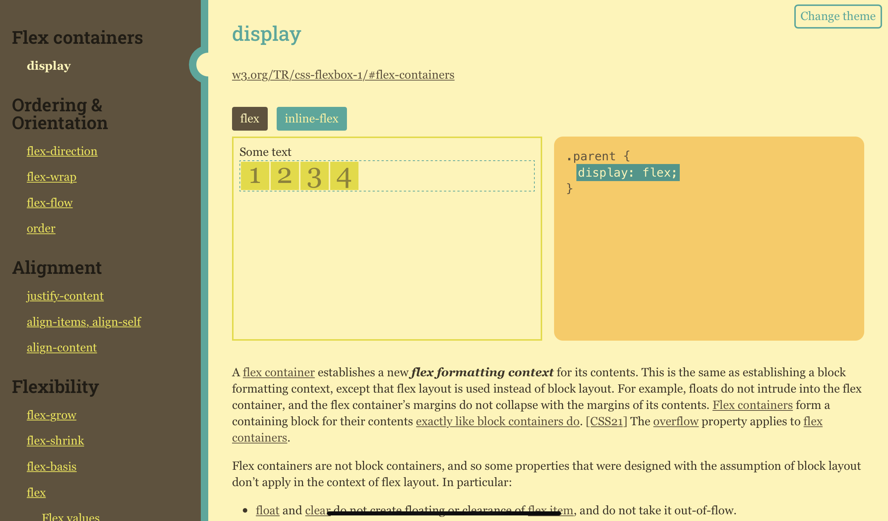

# Flexbox cheatsheet

The list of Flexbox properties with:

* live demos
* code snippets
* definitions from the [W3C Flexbox specification](https://www.w3.org/TR/css-flexbox-1/)

[Flex Cheatsheet](https://fu4303.github.io/flex-cheatsheet/)

All text content belongs to <a href="https://www.w3.org/TR/css-flexbox-1/">W3C Flexbox Specification</a>

Thanks to [Yoksel](https://github.com/yoksel) for the backbones of this project
